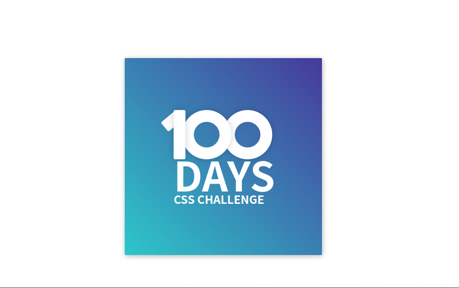

# 100days css 개발기

> 기초적인 css에 대한 연습 및 animation 관련 css나 인터랙션 등 동적이고 화려한 스타일 작업에 대한 연습을 하기 위해 시작한 프로젝트입니다. 사이트는 일 1회를 목표로 하지만 저는 주 1회를 목표로 진행중에 있습니다.

| chapter | 결과물                         | 날짜       | 구현 일지                                                                     |
| ------- | ------------------------------ | ---------- | ----------------------------------------------------------------------------- |
| day1    |  | 2022-11-17 | [day1 study](https://github.com/DoMyBestFor/cssmaster/blob/main/day1/day1.md) |
| day2    |  | 2022-11-26 | [day2 study](https://github.com/DoMyBestFor/cssmaster/blob/main/day2/day2.md) |
| day3    |                                |            |
| day4    |                                |            |
| day5    |                                |            |
| day6    |                                |            |
| day7    |                                |            |
| day8    |                                |            |
