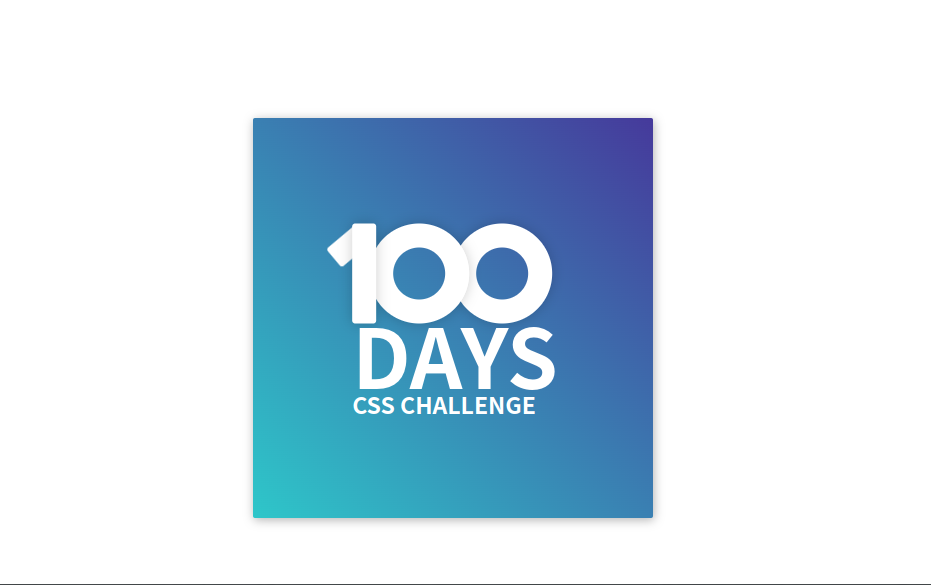

#day1

### problem

https://100dayscss.com/days/1/

### my result

### study

- box-shadow - content에 shadow 효과를 줍니다.

  - x-position: 양수면 오른쪽, 음수면 왼쪽에 그림자가 생김
  - y-position: 양수면 아래쪽, 음수면 위쪽에 그림자가 생깁니다.
  - blur: 값이 클수록 흐려집니다.
  - spread: 양수면 그림자를 확장하고 음수면 축소합니다.
  - color: 그림자 색깔입니다.

- linear-gradient - 그라데이션을 지정합니다.

  - direction : to - 방향
  - color1, color2, .... colorn

- box-sizing - 박스의 사이즈 기준을 설정합니다.

  - content-box : border를 포함하지 않은 size를 기준으로 계산합니다.
  - border-box : border를 포함한 size를 기준으로 계산합니다.

- css의 size 단위
  - % : 백분율 단위 (100%, 150%)
  - em : 배수 단위 (1em, 1.5em)
  - px : px 단위

> 전체 폰트 크기에 절대 크기를 지정하고 (px) 다른 태그에 상대적 크기를 지정하는 방법은 자주 사용됩니다.

- rgba 색상 지정
  - r, g, b에 추가적으로 a는 투명도를 나타냅니다. 0이면 완전히 투명한 상태입니다.
